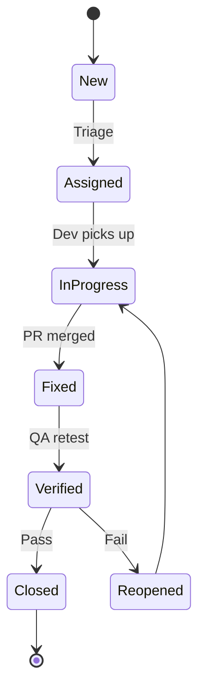

# Defect Lifecycle Tracker

## Workflow Rules
1. Every defect has **unique ID**, **owner**, **target version**.  
2. **Severity** is impact; **Priority** is scheduling – do not conflate.  
3. Retest requires **linked automated test** where feasible (regression).  
4. **Done** means verified in staging + documentation updated if user-visible.

## Sample Kanban Snapshot
| ID | State | Owner | Sprint |
|----|-------|-------|--------|
| DEF-004 | In Progress | Dev-A | S2 |
| DEF-007 | New | — | backlog |
| DEF-003 | Fixed | Dev-B | S1 |
